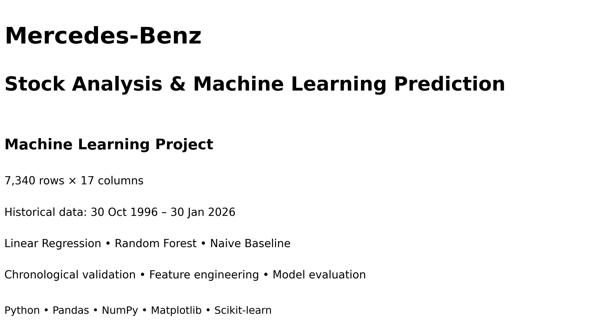
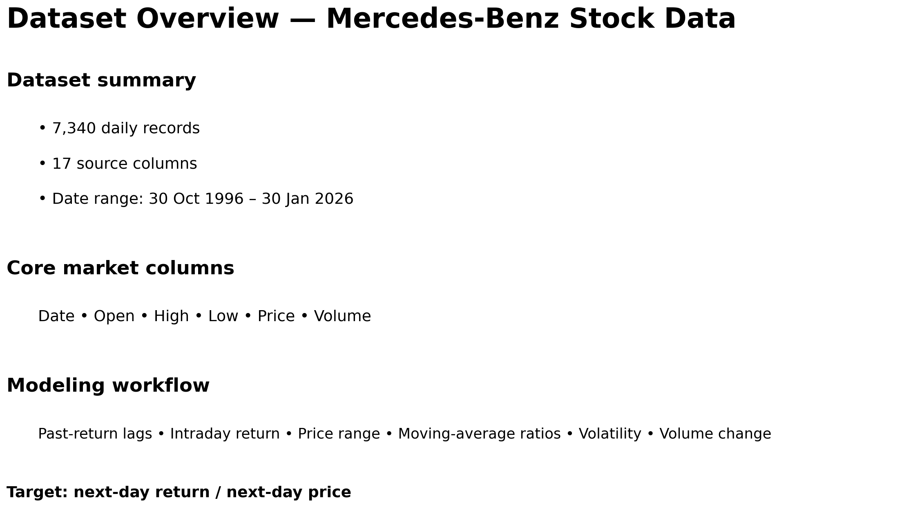
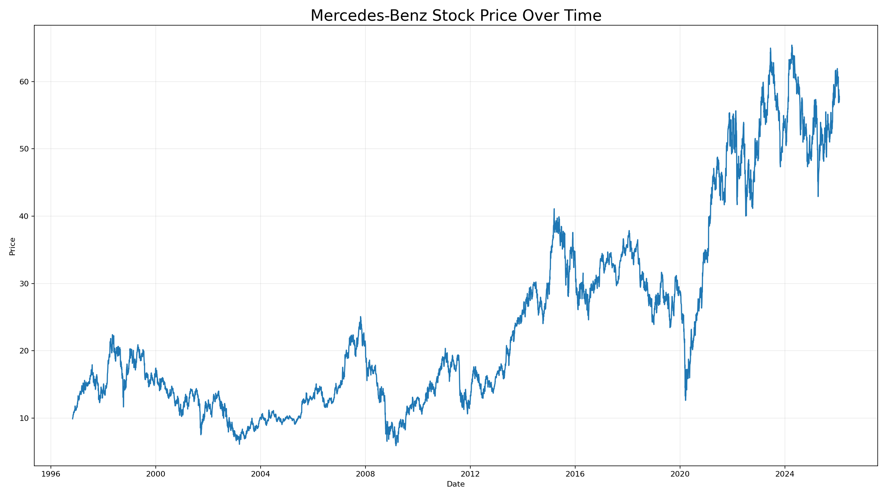
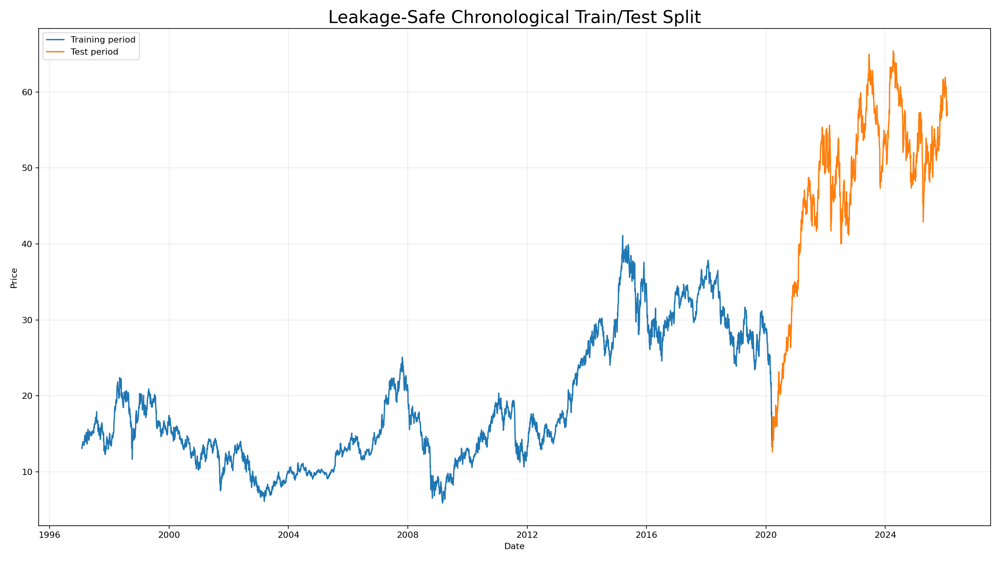
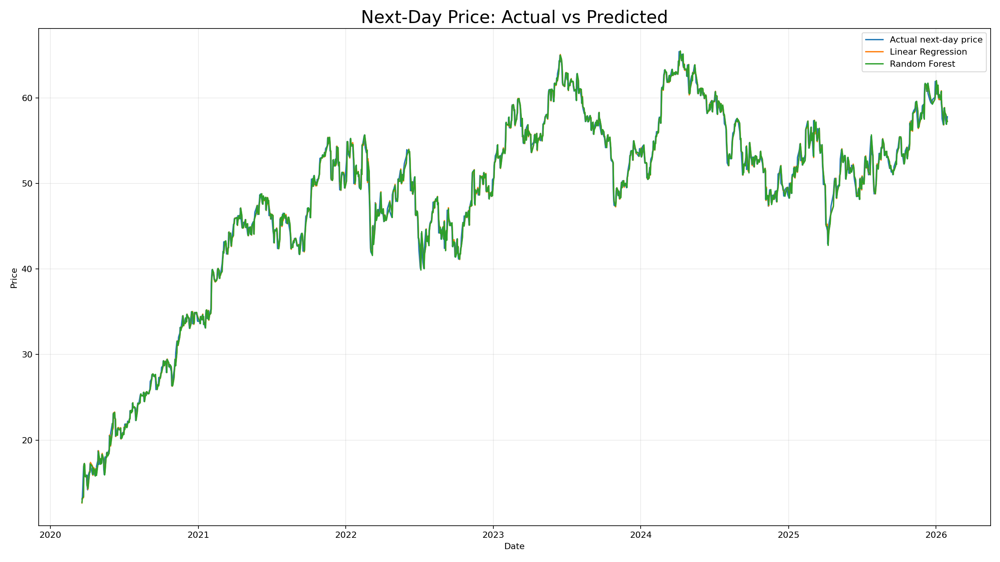
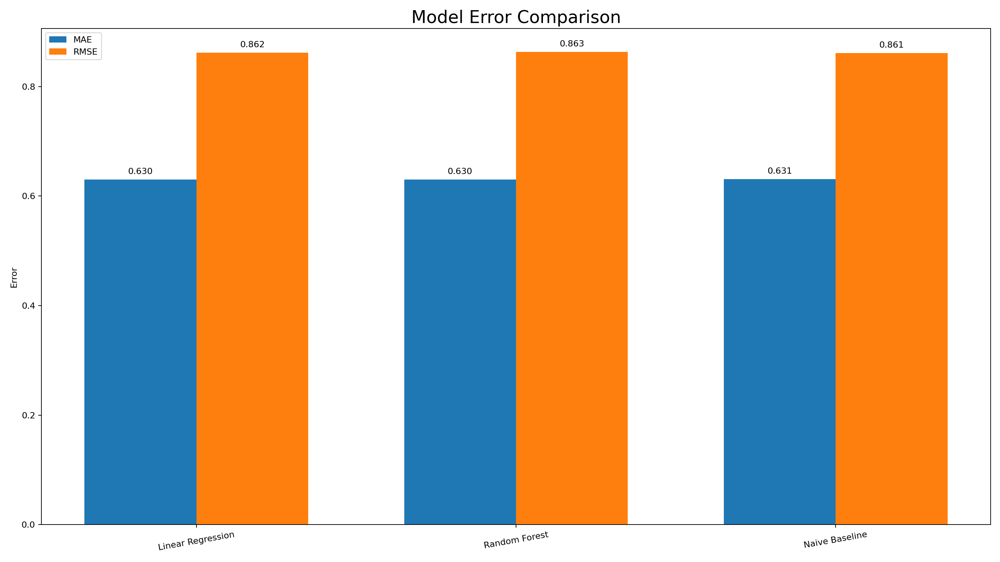
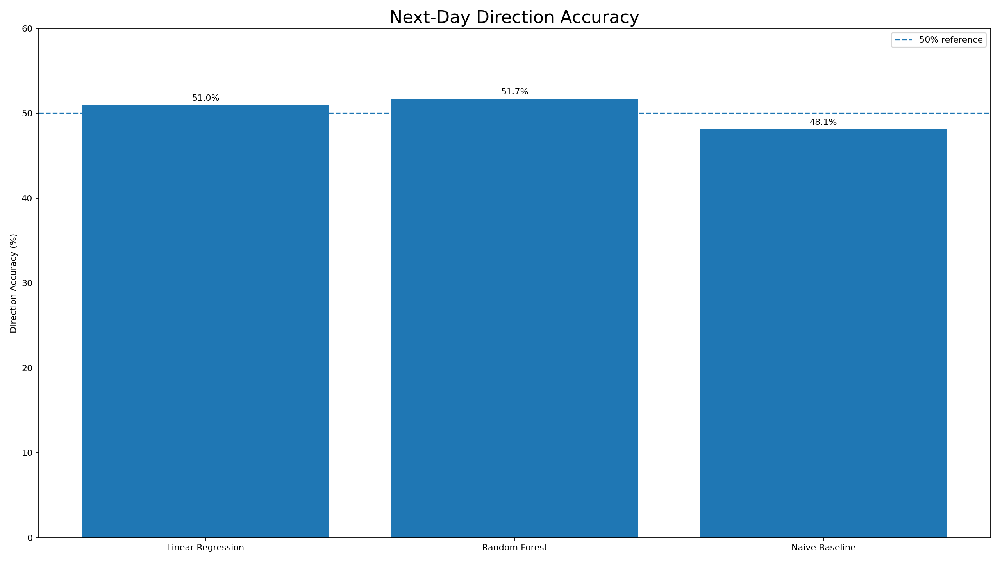
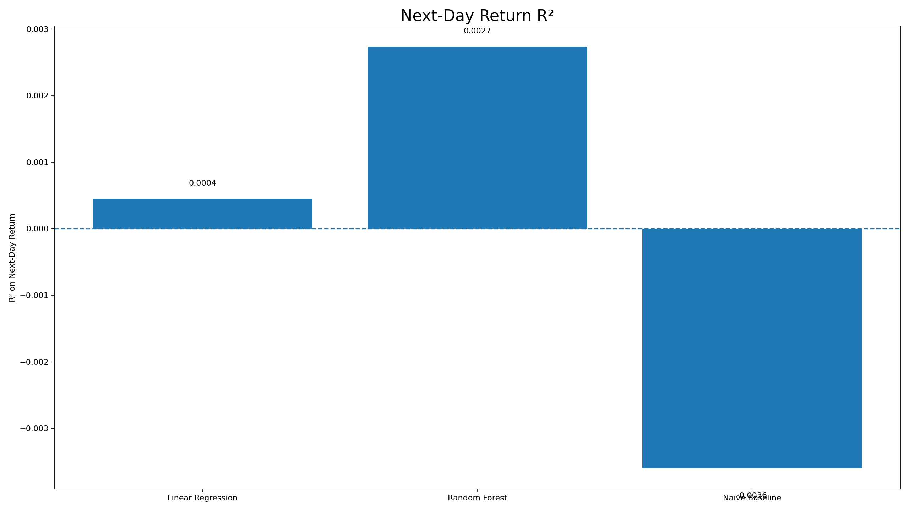

# Mercedes-Benz Stock Analysis & Machine Learning

A machine learning project analyzing long-term Mercedes-Benz stock data using time-series-aware feature engineering, chronological validation, regression models, baseline comparison, and evaluation of next-day price, return, and market direction.



---

## Project Overview

Stock price prediction can be misleading when evaluation focuses only on price-level accuracy.

This project investigates whether historical Mercedes-Benz stock data can provide meaningful predictive power for future market behavior.

Instead of relying only on a high R² score, the project compares machine learning models against a naive baseline and evaluates three different tasks:

- Next-day price prediction
- Next-day return prediction
- Next-day market direction prediction

The goal is to understand not only whether the models produce high scores, but whether they actually provide useful predictive information.

---

## Dataset

The dataset contains approximately **7,340 historical Mercedes-Benz stock records** covering the period from **1996 to 2026**.

It includes market information such as:

- Open price
- High price
- Low price
- Close price
- Trading volume
- Daily returns
- Time-based features
- Lag features
- Rolling statistics



---

## Historical Price Analysis

The first stage of the project explores the long-term behavior of Mercedes-Benz stock prices.



The historical data shows significant changes in stock price levels over time, making proper time-series validation especially important.

---

## Leakage-Safe Validation

Unlike traditional machine learning datasets, stock-market observations have a chronological order.

Using a random train-test split could allow future information to influence model training.

For this reason, the project uses a **chronological 80/20 train-test split**.



This approach keeps the future test period completely separate from the historical training data.

---

## Feature Engineering

The project uses time-series-aware features created only from historical information.

Examples include:

- Previous-day prices
- Lagged returns
- Rolling averages
- Rolling volatility
- Calendar and time-based features

The prediction targets include:

- **Next-Day Price**
- **Next-Day Return**
- **Next-Day Direction**

---

## Models

The project compares:

1. **Linear Regression**
2. **Random Forest Regressor**
3. **Naive Baseline**

The naive baseline assumes that the next day's price will remain close to the current price.

Including this baseline is important because stock prices are highly autocorrelated, which can make simple price-level prediction appear extremely accurate.

---

## Price Prediction Results

Both machine learning models achieved very high R² scores when predicting next-day price levels.

| Model | Price R² |
|---|---:|
| Linear Regression | **0.99414** |
| Random Forest | **0.99413** |
| Naive Baseline | **0.99416** |

At first glance, these results appear extremely strong.

However, the naive baseline achieves approximately the same performance.

This suggests that the high price-level R² is mostly explained by the strong relationship between today's price and tomorrow's price rather than strong predictive power over actual market movements.



---

## Model Error Comparison

The prediction errors of the models were also compared to the naive baseline.



The results reinforce the importance of comparing machine learning models against a simple baseline before interpreting a high evaluation score as meaningful predictive performance.

---

## Market Direction Prediction

Predicting whether the stock will move up or down is more challenging than predicting the general price level.

| Model | Direction Accuracy |
|---|---:|
| Linear Regression | **51.24%** |
| Random Forest | **52.47%** |
| Naive Baseline | **48.15%** |



The machine learning models perform only slightly above the 50% level expected from near-random directional predictions.

---

## Next-Day Return Prediction

Return prediction provides a stricter test of whether the models can actually explain market movements.

| Model | Return R² |
|---|---:|
| Linear Regression | **0.00036** |
| Random Forest | **0.00184** |
| Naive Baseline | **-0.00359** |



The R² values remain extremely close to zero.

This indicates that the models explain almost none of the variation in next-day stock returns.

---

## Key Insight

One of the most important findings from this project is that:

> **A very high price-prediction R² does not necessarily mean that a model can predict stock-market movements.**

Although the models achieved approximately **0.994 R²** for next-day price prediction, the naive baseline achieved almost identical performance.

When evaluated on more difficult targets:

- Return R² remained close to **0**
- Direction accuracy remained close to **50%**

This demonstrates why baseline comparison and proper evaluation metrics are essential when working with financial time-series data.

---

## Technologies Used

- Python
- Pandas
- NumPy
- Matplotlib
- Scikit-learn
- Jupyter Notebook
- Google Colab

---

## Project Structure

```text
Mercedes-Benz-Stock-Analysis/
│
├── README.md
├── mercedes_benz_stock.ipynb
├── mercedes_benz_stock_refined.csv
├── 01_project_cover.png
├── 02_dataset_overview.png
├── 03_price_history.png
├── 04_chronological_split.png
├── 05_actual_vs_predicted.png
├── 06_model_error_comparison.png
├── 07_direction_accuracy.png
└── 08_return_r2.png
